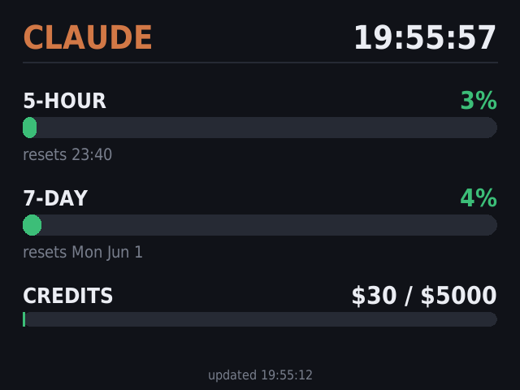

# Claude Quota Display

**A tiny, always-on dashboard for your Claude usage — running on a Raspberry Pi in an adorable little Macintosh.**



---

If you live in Claude Code all day, you've probably had the experience of
slamming into your usage limit mid-thought. The `/usage` command tells you where
you stand, but only when you stop and ask. I wanted something ambient — a little
gauge sitting on my desk that I could glance at the way you glance at a clock.

So I put one inside a 3D-printed Macintosh Plus the size of a coffee mug. It
boots straight into a fullscreen readout of my **5-hour window**, my **7-day
window**, and my **extra-usage credits**, and it refreshes itself every minute.
No browser, no cloud, no dashboard service — just ~250 lines of Python drawing
directly to a tiny screen. This repo is everything you need to build your own.

---

## What it shows

The app reads the same usage data that powers Claude Code's `/usage` command and
renders it as big, across-the-room-readable bars:

- **5-HOUR** — your rolling 5-hour session limit, with the reset time.
- **7-DAY** — your weekly limit, with the reset day.
- **CREDITS** — extra-usage spend against your monthly cap (if you have it enabled).
- A live clock, and a colour code that slides from green → yellow → orange → red
  as you approach a limit.

It's deliberately boring in the best way: a light, steady load — around 130 MB
of RAM and a fraction of one of the Pi's CPU cores (it redraws at a lazy 4 fps) —
and it survives network blips by showing the last known numbers with a small
"stale" marker.

---

## The hardware

Here's the exact bill of materials I used. None of it is special — swap in
whatever you have lying around.

| Part | Notes |
| --- | --- |
| **Raspberry Pi 3B+** | A 3B+ is plenty. A Pi 4 / 5 or even a Zero 2 W works too — this app is featherweight. |
| **Waveshare 3.5″ capacitive touch screen (640×480)** | The star of the show. Shows up as a standard 640×480 display once configured. Touch isn't required by this app, but it's nice. |
| **32 GB microSD card** | Get a fast one (A1/A2, e.g. SanDisk Extreme) — it makes flashing and boot noticeably snappier. 16 GB is fine if that's what you have. |
| **40-pin GPIO ribbon cable** | To get the Pi's GPIO out to the screen at a sensible angle inside the case. |
| **3D-printed case — [Raspberry Pi Macintosh Plus](https://www.printables.com/model/1259764-raspberry-pi-5-macintosh-plus)** | A gorgeous little retro Mac enclosure. (Linked is the newer Pi 5 revision of the case I used — check the fit notes for your Pi model.) |

> 💡 **On the screen:** these small Waveshare panels need a one-time driver /
> `dtoverlay` setup. Follow [Waveshare's wiki](https://www.waveshare.com/wiki/Main_Page)
> for your exact part number. As far as this app is concerned, the only thing
> that matters is that your desktop comes up at **640×480** — everything is laid
> out for that resolution.

---

## Software setup

### 1. Flash Raspberry Pi OS

Use [Raspberry Pi Imager](https://www.raspberrypi.com/software/) to flash the
**64-bit Raspberry Pi OS with desktop** (Bookworm or newer — this was built on
the Debian 13 "trixie" image, which uses the **labwc** Wayland compositor by
default). In the Imager's advanced settings, set your Wi-Fi and enable SSH so you
can do the rest headless.

### 2. Get the screen showing 640×480

Configure the Waveshare panel per its wiki, boot to the desktop, and confirm the
resolution:

```bash
wlr-randr        # should list a 640x480 mode as "current"
```

### 3. Log in to Claude Code

The display piggybacks on your existing Claude Code login — it reads the OAuth
token from `~/.claude/.credentials.json`. So just install and authenticate
Claude Code on the Pi:

```bash
# install Claude Code (see https://claude.com/claude-code for the latest)
claude            # run once and log in with your Anthropic account
```

Any plan with a usage page works (this was built on a Max plan).

### 4. Install the display

```bash
git clone https://github.com/fuziontech/claude-quota-display.git
cd claude-quota-display
./install.sh
```

The installer will:

1. install `python3-pygame` if it's missing,
2. **autohide the top taskbar** so you get the whole 640×480 (`wf-panel-pi`),
3. add the app to the labwc autostart so it launches on every boot and
   auto-restarts if it ever crashes,
4. offer to start it right now without rebooting.

That's it. Reboot and your Pi comes up as a Claude quota gauge.

---

## How it works

It's three small files:

- **`quota_api.py`** — the data layer. It reads your token from
  `~/.claude/.credentials.json` and calls Anthropic's usage endpoint:

  ```
  GET https://api.anthropic.com/api/oauth/usage
  Authorization: Bearer <token>
  anthropic-beta: oauth-2025-04-20
  ```

  which returns `five_hour`, `seven_day`, and `extra_usage` utilization plus
  reset timestamps. While you actively use Claude Code on the Pi, the CLI keeps
  that token fresh for us. As a safety net for a device that mostly just
  displays, the app will **refresh the token itself** (via the OAuth token
  endpoint) if it finds the token has actually expired, and writes the result
  back atomically so it can never corrupt your credentials file.

- **`quota_display.py`** — the UI. A pygame fullscreen app with a background
  thread doing the fetching (so a slow network never freezes the clock) and a
  main loop redrawing at a lazy 4 fps. Layout, colours, and thresholds all live
  at the top of the file.

- **`run.sh`** — a one-line launcher used by the autostart.

No data leaves your Pi except the call to Anthropic's own API — the same call
Claude Code already makes.

---

## Customising it

Everything tweakable is at the top of the two Python files:

| Want to change… | Where |
| --- | --- |
| How often it polls | `POLL_INTERVAL` in `quota_display.py` (default 60s) |
| When data is flagged "stale" | `STALE_AFTER` in `quota_display.py` |
| Colours / theme | the colour constants near the top of `quota_display.py` |
| Colour thresholds (when bars turn yellow/red) | `bar_color()` in `quota_display.py` |
| Which metrics show | the `render()` method in `quota_display.py` |

Run the data layer on its own to see the raw JSON you have to work with:

```bash
python3 quota_api.py
```

---

## Managing it

`Esc` or `q` quits the app (the autostart will bring it back on next boot).

To control the live instance the installer started, export your session env and
talk to the user service:

```bash
export XDG_RUNTIME_DIR=/run/user/$(id -u) WAYLAND_DISPLAY=wayland-0

systemctl --user status  claude-quota.service
systemctl --user restart claude-quota.service
systemctl --user stop    claude-quota.service
```

**To bring the taskbar back permanently**, delete
`~/.config/wf-panel-pi/wf-panel-pi.ini`.

**To disable autostart**, remove the `# Claude quota display` line from
`~/.config/labwc/autostart` (or delete that file to fall back to the system
default).

---

## Troubleshooting

- **Blank screen / app won't launch on boot** — make sure the desktop session is
  labwc/Wayland and that `~/.config/labwc/autostart` contains the launch line.
  Run `./run.sh` from a desktop terminal to see any error directly.
- **"connecting…" never goes away** — your token probably isn't valid. Run
  `claude` once to log in, then `python3 quota_api.py` to confirm you get JSON.
- **Bars look like tiny dots** — that's just a very low percentage rendering as a
  rounded sliver. It's accurate; nudge the bar code if it bugs you.
- **Wrong resolution / cut-off layout** — the UI is hard-coded for 640×480. If
  your panel is a different size, adjust `WIDTH`/`HEIGHT` and the y-offsets in
  `quota_display.py`.

---

## A note on privacy

This reads your local Claude credentials to authenticate, exactly as Claude Code
does. It only ever contacts Anthropic's API. Don't commit your
`~/.claude/.credentials.json` anywhere, and treat the Pi like any logged-in
device.

---

## License

MIT — see [LICENSE](LICENSE). Build one, put it in a tiny Mac, share a photo. 🖥️
